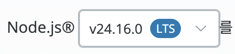
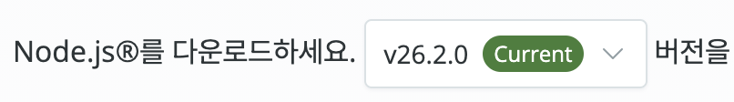

# 프로젝트 빌드하기

> [!TIP]
> 만약 빌드가 귀찮으시다면,  
> [GitHub Pages](https://pji2918.github.io/school-to-do/)에서 빌드된 페이지를 바로 보실 수도 있습니다.

해당 프로젝트는 TypeScript를 사용하는 [Vite](https://vite.dev/) 프로젝트입니다.
그말인 즉슨, 바로 실행이 불가능합니다. 페이지를 보려면 번들링(HTML, CSS, JS로 묶는 행위) 작업을 해 주셔야 합니다.

## 준비물

> [!WARNING]
> 본 프로젝트는 `Temporal` API를 사용하므로, Node.js 26 버전 이상을 사용하셔야 정상적으로 빌드하실 수 있습니다.

- Node.js (26+)
- pnpm(Corepack으로 빠른 설치 가능)
- 키보드 (화상 키보드 사용 가능)
- 터미널 사용 능력 (명령어를 입력하고 출력을 인지하실 수만 있으면 됩니다)

### Node.js 설치하기

두 가지 방법이 있습니다.

#### fnm(버전 관리자) 사용하기 (권장)

> [!NOTE]
> nvm을 사용하셔도 무방합니다.
> 여기에서는 fnm을 사용하겠습니다.

[여기](https://github.com/Schniz/fnm)에 있는 지침에 따라 fnm을 설치하신 다음, 아래 명령어를 입력해서 Node.js 26 버전을 설치합니다.
```bash
fnm install --use
```

#### 직접 설치하기

1. [https://nodejs.org/ko/download](https://nodejs.org/ko/download)로 이동합니다.
2. Node.js 버전을 24(LTS)에서 26(Current)로 변경합니다.
<table style="text-align: center;">
    <tr>
        <td></td>
        <td></td>
    </tr>
    <tr>
        <td>잘못된 예</td>
        <td>옳은 예</td>
    </tr>
</table>
3. Node.js를 설치합니다. 페이지의 지시에 따르시면 됩니다.

### pnpm 설치하기

> [!NOTE]
> pnpm이 이미 설치되어 있으시다면 이 단계는 건너뛰어도 무방합니다.

다음 명령어를 입력합니다.
```bash
npm install -g corepack
corepack install
corepack enable
```

## 빌드하기
다음 명령어를 순서대로 입력합니다.

```bash
pnpm ci
pnpm build
```

빌드가 완료되었습니다. 이제 `dist` 폴더에서 빌드된 결과물을 확인하실 수 있습니다. 바로 열어보거나, 웹 서버에 업로드하시면 됩니다.